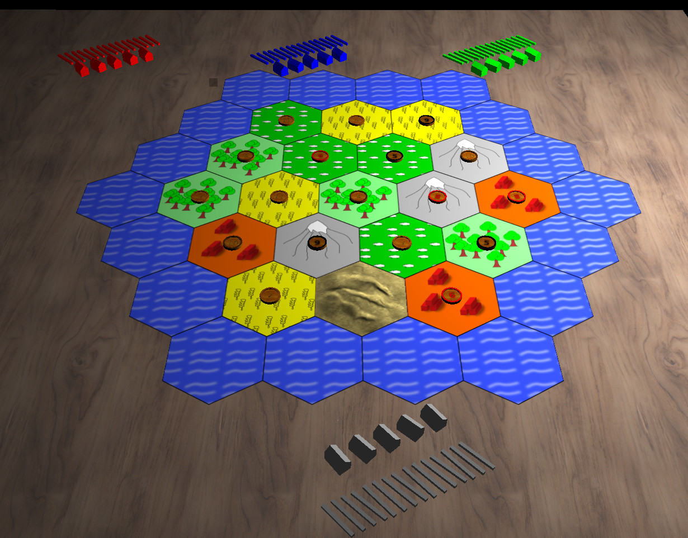

# Pioneers 3d

Pioneers is an Internet playable implementation of the Settlers of
Catan board game.  The aim is to remain as faithful to the board game
as is possible. The original game source is stored at sourceforge: 

https://sourceforge.net/projects/pio/

This project was created to create a 3D-client for this implementation of
Settlers of Catan for Linux and Windows. 

Currently the game is not playable via the 3d client ad piggybacks off the 
standard client. As the project matures, it should be possible to transition 
away from the 2d gtk client and fully commit to the 3d implementation. The 
project is not there yet though.

